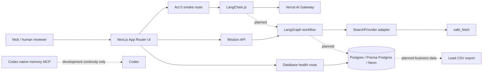

# System overview

Monster Scout is a standalone Vercel-native application during bootstrap and MVP. It does not read from or write to Monster CRM. The first external boundary is an approved lead CSV export; a CRM bridge comes later, behind a dry-run contract.

The planned UI boundary is the Next.js App Router. Server components render mission views; client components are limited to interactive controls and UI transport. Server-only routes own secrets and external calls.

The first Act 1 graph slice is the typed mission-preparation path: `POST /api/missions` validates a `SalesMissionBrief`, then LangGraph builds a bounded `TargetProfile` and `SearchStrategy` before stopping at `READY_FOR_DISCOVERY`. It does not search the web, persist business entities or call CRM systems yet.

The discovery-stage `safe_fetch` tool is server-only and deterministic. It validates public HTTP(S) destinations, resolves and revalidates DNS on every redirect, blocks private and reserved addresses, follows only bounded redirects, enforces MIME/byte/timeout caps, and returns hashed readable text with retrieval provenance. Fetched text remains untrusted data.

The bounded discovery segment consumes prepared mission state through `discoverSalesMission`: `search_provider` calls the default `DuckDuckGoSearchProvider` or an injected `SearchProvider` adapter within the search budget, then `fetch_official_sources` calls `safe_fetchTool` within the page budget. Search results are schema-validated and deduplicated; source failures become typed partial-result errors and do not invalidate successful sources. A public discovery route is not configured yet.

LangChain owns model integration, typed tools, structured extraction, bounded chains, RAG and first-touch drafting. LangGraph is the sole workflow orchestrator and will own durable mission execution, interrupts and checkpointed graph state. The Act 0 smoke path proves only the LangChain-to-AI-Gateway connection.

Deterministic TypeScript owns validation, duplicate detection, privacy rules, scoring, score caps, budgets, idempotency, export eligibility and future CRM eligibility. Models propose structured material; they do not make final sales or privacy decisions.

Postgres stores business entities and audits. LangGraph checkpoints store execution state and references, not duplicate copies of full source pages. Codex native memory is development continuity only and is not part of the Monster Scout runtime.

Bootstrap non-goals are buying-signal detection, contact discovery, scoring, human-in-the-loop graph interrupts, pgvector ingestion, automatic outreach, Redis, queues, browser automation and CRM integration. The bounded discovery graph now uses DuckDuckGo for search and `safe_fetchTool` for source acquisition, but no public discovery route is configured.
