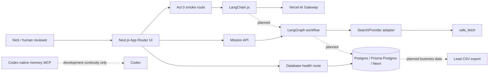

# System overview

Monster Scout is a standalone Vercel-native application during bootstrap and MVP. It does not read from or write to Monster CRM. The first external boundary is an approved lead CSV export; a CRM bridge comes later, behind a dry-run contract.

The planned UI boundary is the Next.js App Router. Server components render mission views; client components are limited to interactive controls and UI transport. Server-only routes own secrets and external calls.

The first Act 1 graph slice is the typed mission-preparation path: `POST /api/missions` validates a `SalesMissionBrief`, then LangGraph builds a bounded `TargetProfile` and `SearchStrategy` before stopping at `READY_FOR_DISCOVERY`. It does not search the web, persist business entities or call CRM systems yet.

The discovery-stage `safe_fetch` tool is server-only and deterministic. It validates public HTTP(S) destinations, resolves and revalidates DNS on every redirect, blocks private and reserved addresses, follows only bounded redirects, enforces MIME/byte/timeout caps, and returns hashed readable text with retrieval provenance. Fetched text remains untrusted data.

The bounded discovery segment consumes prepared mission state through `discoverSalesMission`: `search_provider` calls the default `DuckDuckGoSearchProvider` or an injected `SearchProvider` adapter within the search budget, `fetch_official_sources` calls `safe_fetchTool` within the page budget, `extract_accounts` uses the registry's extraction model on bounded untrusted excerpts, and `verify_buying_signals` uses the registry's verification model on typed candidates. Search results and model outputs are schema-validated; source failures and model failures become typed partial-result errors and do not invalidate successful accounts. Deterministic TypeScript checks source-quote support, content-hash provenance, event-date support, freshness and final verification status. `POST /api/missions/discover` is the Node.js server boundary for a fresh run; it returns bounded source references and never raw page bodies.

LangChain owns model integration, typed tools, structured extraction, bounded chains, bounded retrieval/RAG and first-touch drafting. The restored checklist and positioning sources are deterministically ingested into hashed, authority-tagged Markdown-section artifacts under `knowledge/ingested/`. An initial local lexical Monster knowledge retriever is implemented and wired into first-move drafting through a stable `MonsterKnowledgeRetriever` abstraction. It provides bounded, authority-aware retrieval without embeddings, a vector store, network calls or additional infrastructure. This is the current MVP retrieval adapter, not the final governed semantic retrieval layer; governed semantic and hybrid retrieval remain planned future work. LangGraph is the sole workflow orchestrator and will own durable mission execution, interrupts and checkpointed graph state. The Act 0 smoke path proves only the LangChain-to-AI-Gateway connection.

Deterministic TypeScript owns validation, duplicate detection, privacy rules, scoring, score caps, budgets, idempotency, export eligibility and future CRM eligibility. Models propose structured material; they do not make final sales or privacy decisions.

Postgres stores missions, runs, accounts, evidence, buying signals, review snapshots, audit events and LangGraph checkpoints. Persistence uses stable mission/run/entity keys and Prisma upserts; review snapshots store references and bounded state, not duplicate full source pages. LangGraph remains the sole workflow state machine, interrupts after verification, and resumes with the same `missionRunId`/`thread_id`. Prospect scores are deterministic snapshots with visible caps. Codex native memory is development continuity only and is not part of the Monster Scout runtime.

Bootstrap non-goals are vector indexing, broad contact crawling, automatic outreach, Redis, queues, browser automation and live CRM writes. The bounded discovery graph now uses DuckDuckGo for search, `safe_fetchTool` for source acquisition, registry-selected structured extraction and verification models for bounded interpretation, Prisma persistence for mission evidence and pending review snapshots, Postgres checkpoint/resume with review decisions, provenance-linked contact routes, approved first-move drafts and approved CSV dry-run export.
