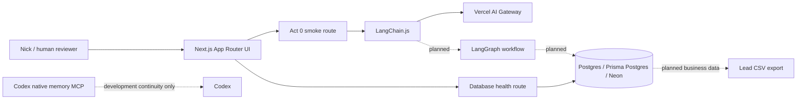

# System overview

Monster Scout is a standalone Vercel-native application during bootstrap and MVP. It does not read from or write to Monster CRM. The first external boundary is an approved lead CSV export; a CRM bridge comes later, behind a dry-run contract.

The planned UI boundary is the Next.js App Router. Server components render mission views; client components are limited to interactive controls and UI transport. Server-only routes own secrets and external calls.

LangChain owns model integration, typed tools, structured extraction, bounded chains, RAG and first-touch drafting. LangGraph is the sole workflow orchestrator and will own durable mission execution, interrupts and checkpointed graph state. The Act 0 smoke path proves only the LangChain-to-AI-Gateway connection.

Deterministic TypeScript owns validation, duplicate detection, privacy rules, scoring, score caps, budgets, idempotency, export eligibility and future CRM eligibility. Models propose structured material; they do not make final sales or privacy decisions.

Postgres stores business entities and audits. LangGraph checkpoints store execution state and references, not duplicate copies of full source pages. Codex native memory is development continuity only and is not part of the Monster Scout runtime.

Bootstrap non-goals are live web search, buying-signal detection, contact discovery, scoring, human-in-the-loop graph interrupts, pgvector ingestion, automatic outreach, Redis, queues, browser automation and CRM integration.
