# How Monster Scout Works — MVP Internal Mechanism

## Audience

This guide explains the Monster Scout MVP to developers, reviewers and technical stakeholders who need to understand what happens inside a mission run.

It complements the [MVP usage guide](using-monster-scout-mvp.md). The usage guide explains what to do; this document explains why the application behaves as it does.

---

# 1. Architectural principle

Monster Scout separates probabilistic model work from deterministic governance.

Models may:

- turn a brief into a target profile;
- create bounded search strategies;
- extract candidate account facts from fetched text;
- interpret possible buying signals;
- draft a first move using supplied evidence and Monster knowledge.

Deterministic TypeScript owns:

- schema validation;
- budgets and caps;
- URL and network safety;
- evidence provenance;
- date and freshness checks;
- account scoring;
- score caps;
- review eligibility;
- export eligibility;
- do-not-contact behaviour;
- CRM dry-run boundaries.

LangGraph owns workflow state, checkpoints, review interruption and resume.

Postgres owns durable business entities and graph checkpoint storage.

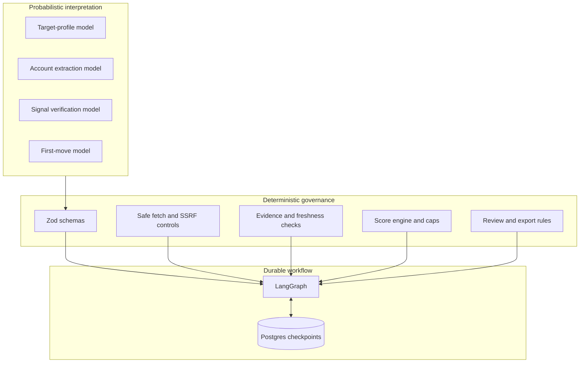

The model is never the final authority merely because it produced confident prose.

---

# 2. Runtime boundary

The application is a standalone Next.js App Router project.

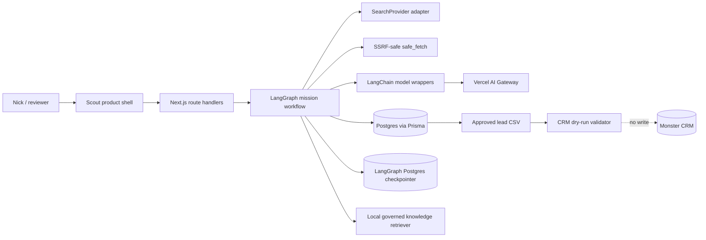

Important boundaries:

- public research is performed server-side;
- secrets remain in server-side environment variables;
- raw page bodies are not returned to the browser;
- Monster CRM is not written by the MVP;
- first-move drafts are not sent;
- the UI is a reviewer surface, not the workflow authority.

---

# 3. Mission lifecycle

A mission begins with a validated `SalesMissionBrief` and ends at a human-reviewed result.

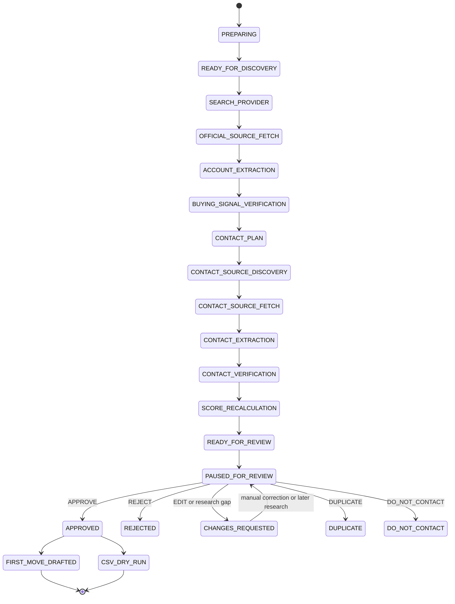

The exact persisted enum names may differ by entity, but the behavioural boundary is as shown.

## Discovery execution and live progress

The bounded discovery path remains available as one HTTP request for API compatibility:

```text
POST /api/missions/discover
```

The Scout run screen uses the streamed route instead:

```text
POST /api/missions/discover/stream
```

It receives newline-delimited stage and search-query events while the graph runs. Each event is also persisted against the `missionRunId`, so a refresh or later dossier read can recover the saved output. The synchronous route remains useful for callers that only need the completed JSON response.

This distinction matters:

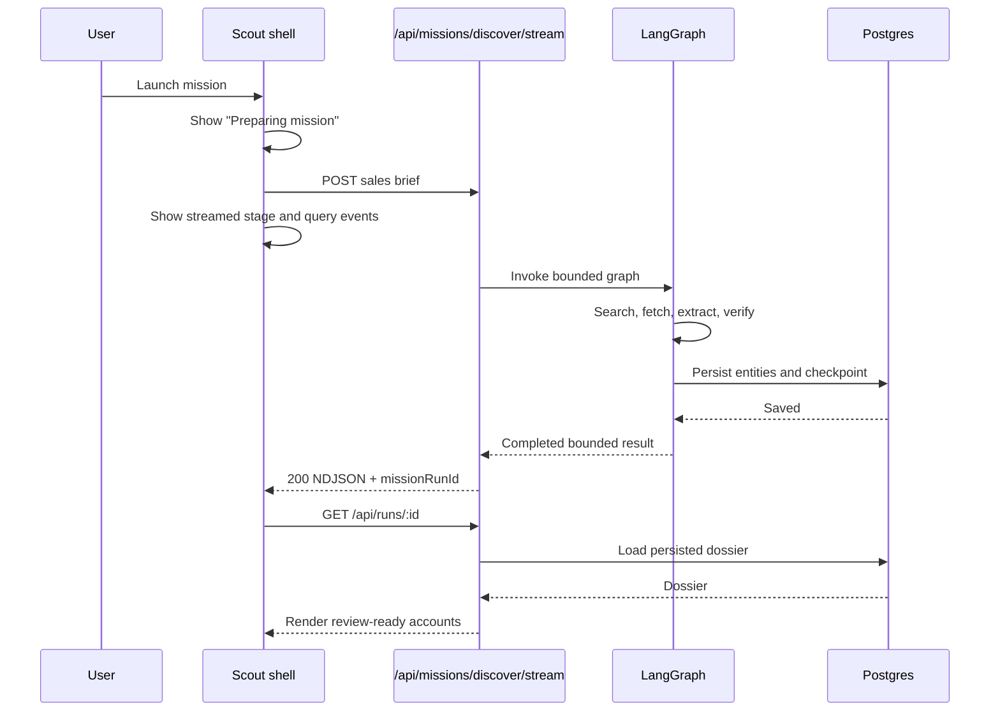

The stream exposes named workflow stages and bounded query metadata, not hidden chain-of-thought or raw page bodies. After buying-signal verification, the graph performs a bounded contact pass: it uses saved official-page links and explicit page metadata first, then may issue one focused same-site search and fetch up to three official contact pages per account. `PUBLIC_EMAIL` is evaluated only after this pass; unknown or missing contact data stays visible as a research gap. The same run can later be continued through `POST /api/runs/:missionRunId/search-more`, or one account can receive a focused contact continuation through `POST /api/runs/:missionRunId/accounts/:accountId/contact-enrichment`; all additional query results and progress remain attached to that run.

---

# 4. Mission preparation

The mission brief is schema validated before research.

Typical fields include:

- mission name;
- target geographies;
- account categories;
- preferred buyer roles;
- product focus;
- signal requirements;
- run limits and budget.

LangGraph first produces bounded mission-preparation state:

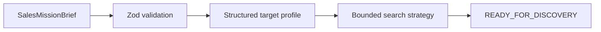

A separate `POST /api/missions` route can stop at this preparation stage without performing live web research.

The New mission screen launches the combined preparation-and-discovery route directly.

---

# 5. Search provider

Search is accessed through a provider abstraction rather than being hard-wired into the graph.

Conceptually:

```ts
interface SearchProvider {
  search(input: SearchRequest): Promise<SearchResult[]>;
}
```

The current default adapter uses DuckDuckGo's non-JavaScript HTML search surface.

The graph depends on the project search shape, not on provider-specific response objects.

Benefits:

- a paid provider such as Brave can be added later;
- tests can inject fixtures;
- the workflow does not need to change with the provider;
- search budgets remain centralised.

Search-result snippets are discovery material. They are not automatically final evidence when an official source can be fetched.

---

# 6. Safe source acquisition

`safe_fetch` is a deterministic security boundary.

It exists because allowing a model or user-provided URL to be fetched without validation creates an SSRF risk.

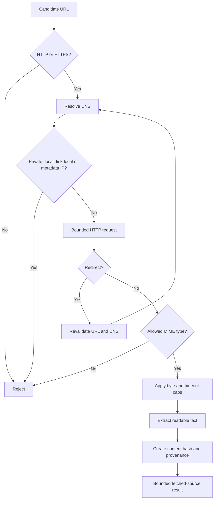

The fetcher:

- accepts public HTTP and HTTPS only;
- blocks localhost, private, reserved, link-local and metadata-service destinations;
- revalidates DNS after redirects;
- caps redirects, bytes and elapsed time;
- restricts content types;
- creates a content hash;
- records retrieval time and final URL;
- treats page content as untrusted data.

## HTTP 403 behaviour

Some legitimate public sites reject automated HTTP clients.

The MVP does not bypass these protections. A 403 becomes a visible partial error.

This is intentional. The correct fallback is another public source or human research, not access-control circumvention.

---

# 7. Structured account extraction

The extraction model receives bounded, untrusted page excerpts and must return a schema-validated structure.

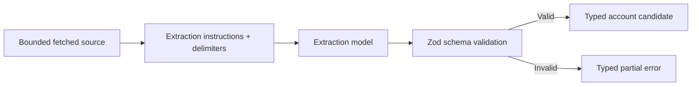

A candidate can include:

- company name;
- official domain;
- location;
- categories;
- relevance hypothesis;
- potential buyer roles;
- unresolved questions;
- source content hash.

The model output is still a proposal. Deterministic code links it back to source evidence and creates stable account keys.

Malformed output does not invalidate other successful candidates.

---

# 8. Buying-signal verification

Buying signals answer the commercial question:

> Why might this account be worth contacting now?

Examples include expansion, a new programme, a new venue, partnership activity or comparable attraction operation.

Verification is intentionally stricter than extraction.

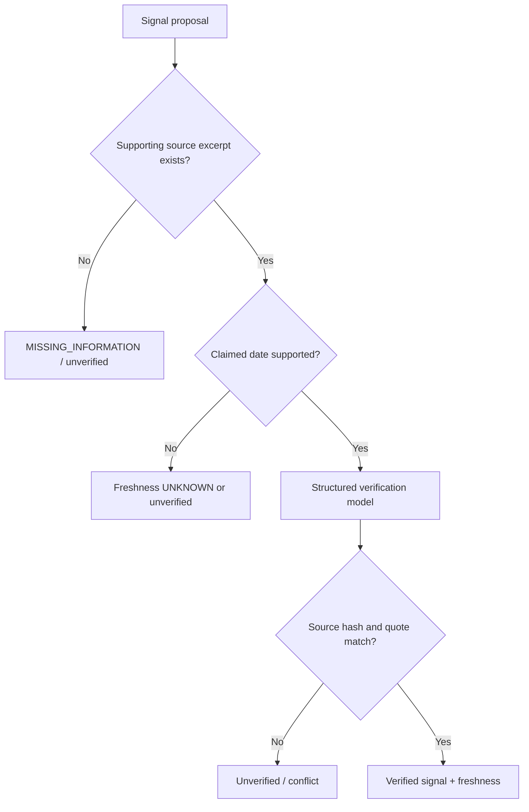

The deterministic layer checks:

- source-quote support;
- content-hash provenance;
- event-date support;
- freshness classification;
- schema validity.

A model cannot promote unsupported text into a verified current signal.

---

# 9. Partial-failure model

Monster Scout is designed to preserve successful work when one source or account fails.

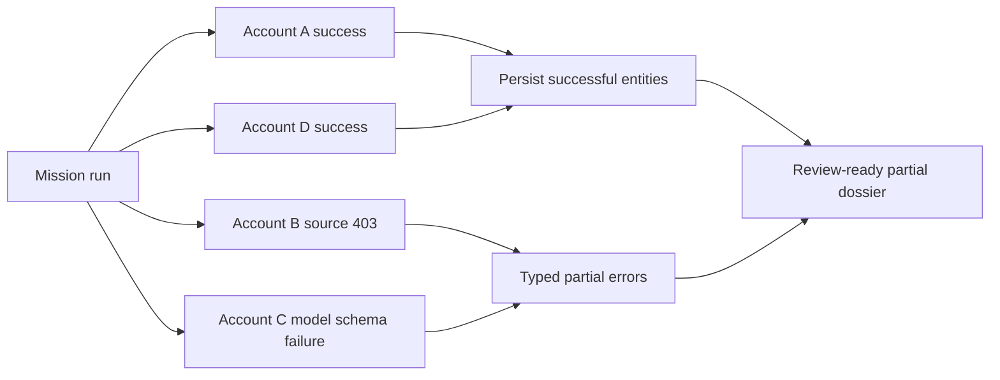

The discovery route can return `201` even when individual operations failed.

This means:

- the bounded mission completed;
- successful results were persisted;
- individual failures are represented in `warnings[]` or `errors[]`.

It does **not** mean every requested account was successfully researched.

---

# 10. Persistence model

Monster Scout stores workflow state and business entities separately.

## Business persistence

Prisma-managed PostgreSQL tables hold entities such as:

- missions;
- mission runs;
- prospect accounts;
- evidence;
- buying signals;
- score snapshots;
- contact routes;
- review snapshots and decisions;
- first-move drafts;
- audit events.

## Workflow persistence

The LangGraph Postgres checkpointer stores checkpointed graph state by thread.

The key identity rule is:

```text
missionRunId = LangGraph thread_id
```

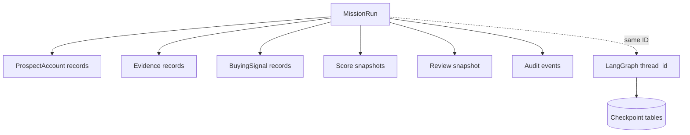

Graph state stores references and bounded execution state, not full raw page bodies or duplicate copies of the business database.

## Idempotency

Stable keys and Prisma upserts prevent repeated workflow steps from creating duplicate records.

This is essential because interrupted or retried graph nodes may execute again.

---

# 11. Human review and checkpoint resume

The graph pauses after verification and persistence.

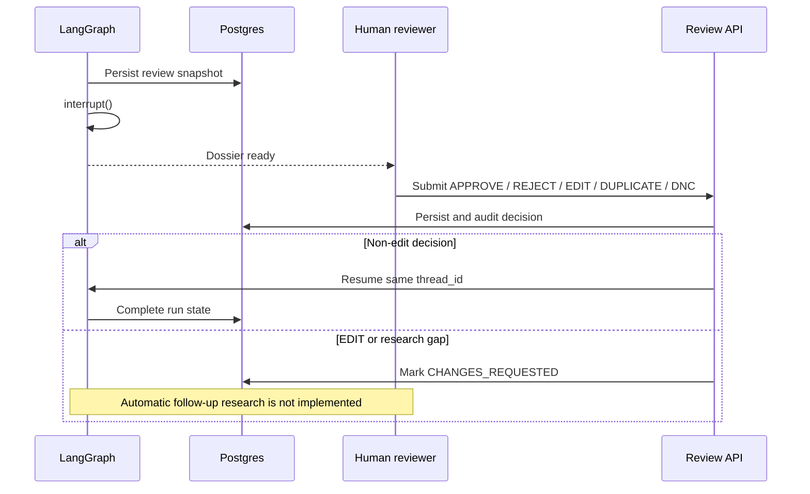

Review actions have governance meaning:

- `APPROVE` permits first-move preparation and export;
- `REJECT` ends the opportunity path;
- `EDIT` requests changes;
- `DUPLICATE` prevents duplicate treatment;
- `DO_NOT_CONTACT` blocks sales action regardless of score.

## Research-gap capture

The structured research-gap endpoint records one missing question and changes the review to `CHANGES_REQUESTED`.

It does not yet create a bounded continuation subgraph. That is an explicit MVP limitation.

---

# 12. Deterministic scoring

The model supplies structured evidence and classifications. TypeScript calculates the score.

Conceptually:

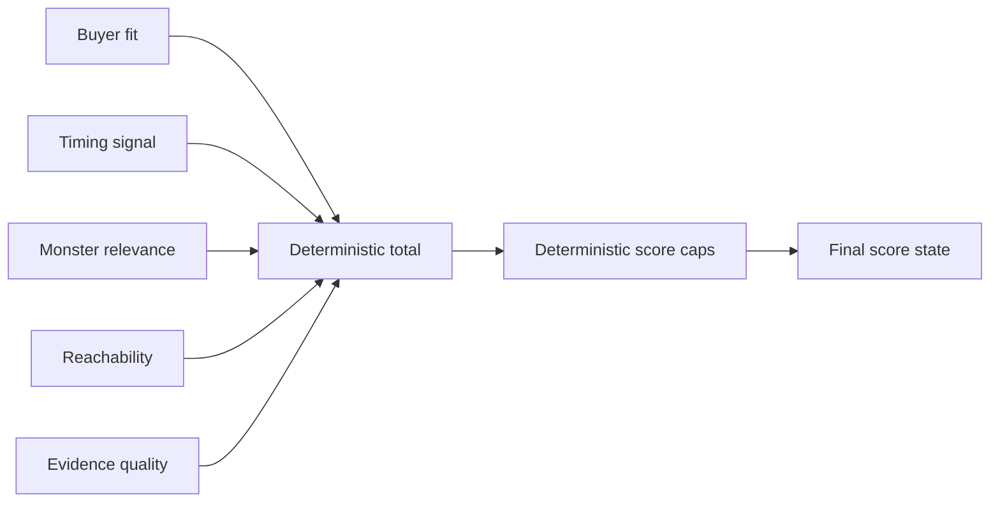

A cap can reduce the maximum available score when required evidence is absent.

Examples:

- no usable public contact route;
- weak commercial evidence;
- missing current timing signal;
- unresolved duplicate state.

The dossier displays caps so reviewers can see why the score is limited.

A score does not replace human review.

---

# 13. Contact-route governance

Monster Scout looks for a route into a commercial conversation, not merely a person's name.

Supported route types may include:

- confirmed public professional and role;
- relevant role without a confirmed person;
- official partnerships page;
- official commercial enquiry route;
- public business email;
- official contact page.

The system must not:

- derive email patterns;
- guess personal email addresses;
- claim a current role without evidence;
- use private or breached datasets;
- override opt-out or do-not-contact state.

A role-only route is a valid honest result.

---

# 14. Governed Monster knowledge

The knowledge corpus currently contains:

1. the authoritative operational and commercial checklist;
2. the product-deck positioning addendum.

Ingestion is deterministic and produces checked-in artifacts with:

- source authority type;
- effective date;
- active/deprecated state;
- Markdown section ID;
- source hash;
- chunk hash.

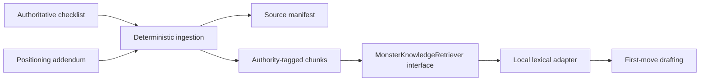

## Authority

Operational and commercial checklist material outranks positioning material.

RAG does not replace deterministic rules for:

- pricing;
- discounts;
- exclusivity;
- deposits;
- venue feasibility;
- safety and compliance;
- do-not-contact decisions;
- CRM eligibility.

## Current retriever

The active MVP adapter is lexical and local.

It:

- excludes deprecated chunks;
- supports authority filters;
- caps result count;
- caps returned characters;
- makes no embedding call;
- uses no vector database;
- makes no network call at retrieval time.

First-move drafting uses a stricter subset of the general retrieval budget.

This is an intentional MVP implementation, not the final semantic architecture.

Embeddings, pgvector and evaluated hybrid retrieval remain roadmap work.

---

# 15. First-move drafting

First-move generation is gated by approval.

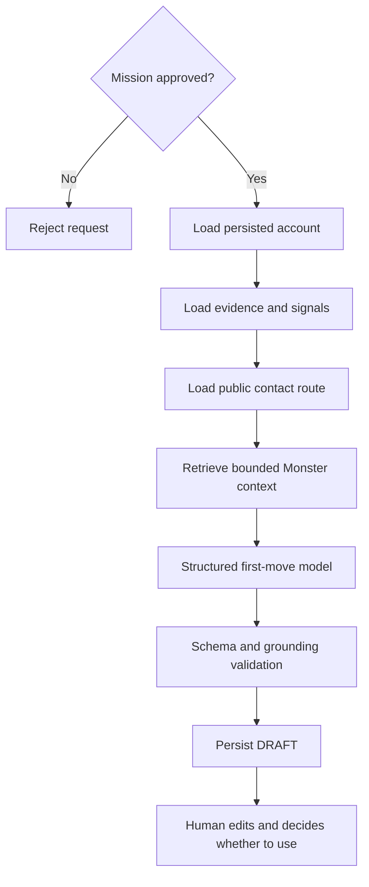

The draft is not an outreach action.

The model receives only bounded evidence, routes and knowledge context. Unknown facts must remain unknown.

The human reviewer must still check tone, freshness and commercial appropriateness.

---

# 16. Export and CRM boundary

Approved records can be transformed into the governed lead-sheet CSV schema.

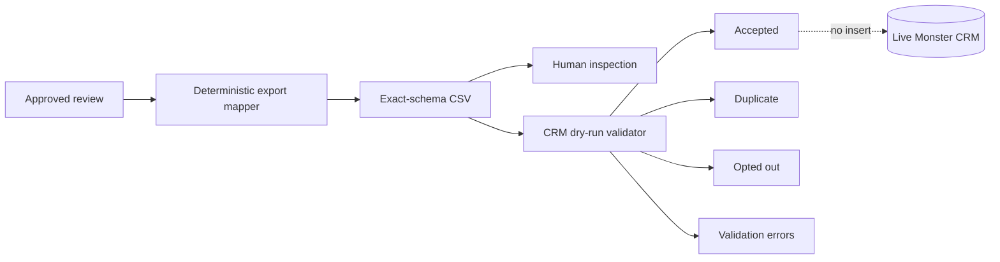

The export mapper preserves blank unknowns and contact provenance.

The CRM dry-run route uses:

- bearer-token authentication;
- an organisation header;
- a configured service role;
- an idempotency key;
- supplied existing-company and opt-out snapshots.

It does not perform a live insert.

Live CRM insertion requires stronger authentication, organisation-level RBAC, final idempotency and audit contracts.

---

# 17. Observability

The MVP has three complementary observability layers:

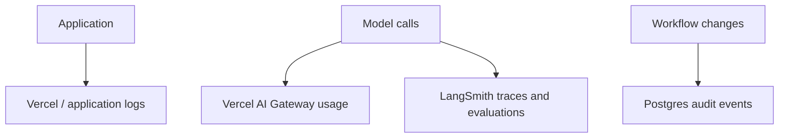

The observability health route reports LangSmith configuration without leaking credentials.

Configuration health is not delivery proof. A live model call and direct inspection of the configured LangSmith project are required to prove trace arrival.

The current evaluation suite includes:

- lexical retrieval cases;
- live structured first-move cases;
- automated proxy scores;
- a human judgment sheet for usefulness and grounding.

Automated proxy scores are not a substitute for Nick's judgment.

---

# 18. Security and trust boundaries

The MVP is public-business research, not surveillance.

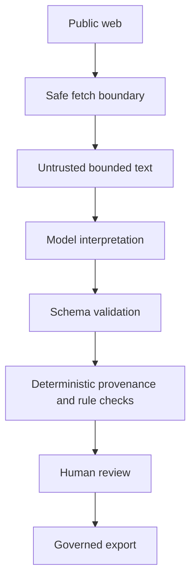

Non-negotiable rules include:

- no private-network fetching;
- no login or CAPTCHA bypass;
- no guessed email addresses;
- no private social-profile scraping;
- no sensitive personal-data enrichment;
- no autonomous outreach;
- no live CRM write in the MVP;
- no hidden chain-of-thought display;
- no silent removal of warnings or unknowns.

---

# 19. Failure behaviour

## Database unavailable

Mission persistence and dossier routes fail with typed service errors. The application must not claim a durable mission exists when persistence failed.

## Model output invalid

The relevant account or signal becomes a typed partial failure. Other successful work can continue.

## Search provider unavailable

The mission records the failure and may return fewer results. The provider abstraction allows later replacement.

## Source returns 403

The source failure remains visible. The application does not bypass it.

## Checkpoint resume fails

The explicit resume route exists for operational recovery. Stable thread IDs and idempotent writes reduce duplicate effects.

## Knowledge retrieval returns no suitable context

First-move drafting must not invent Monster claims. Missing context should remain missing or constrain the draft.

## CRM dry-run authentication fails

The route returns `401` for missing/invalid authentication and `403` for an invalid organisation or role boundary.

---

# 20. Current MVP versus future architecture

| Capability | MVP status | Future direction |
|---|---|---|
| Mission launch | Implemented | richer editable target profile |
| Discovery progress | Client-side named status | real graph event streaming |
| Search | DuckDuckGo adapter | optional Brave/other providers |
| Source fetching | SSRF-safe bounded fetch | broader reachable-source strategies without bypass |
| Account target | up to five | measured expansion after evaluation |
| Checkpointing | Postgres checkpointed | operational hardening |
| Human review | implemented | richer per-account decisions |
| Research gap | recorded | bounded automatic follow-up subgraph |
| Scoring | deterministic and capped | evaluation-driven tuning |
| Contacts | provenance-linked limited routes | broader public contact discovery |
| Knowledge retrieval | local lexical | evaluated semantic/hybrid pgvector retrieval |
| First move | approved persisted draft | richer human editing, still no auto-send by default |
| CSV export | exact-schema dry run | approved CRM integration |
| CRM | authenticated dry-run validation | live insert behind RBAC/audit/idempotency |
| Authentication | limited service boundary | SSO, token rotation, organisation RBAC |
| Observability | configured health + evaluations | independently verified production trace delivery |

---

# 21. Honest technical description

A precise description of the current system is:

> Monster Scout is a Next.js and TypeScript prospect-research MVP using LangChain for structured model work and LangGraph for checkpointed mission orchestration. It performs bounded public-web discovery, applies SSRF-safe source fetching, extracts and verifies evidence-backed prospect information, persists dossiers and audit state in PostgreSQL, pauses for human review, retrieves governed local Monster knowledge for approved first-move drafting, and exports exact-schema lead records without sending outreach or writing to the live CRM.

That description is strong enough. There is no need to inflate the MVP into an autonomous or fully streaming agent system.
