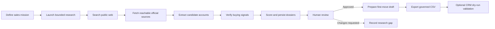

# Using Monster Scout — MVP Guide

## Purpose

Monster Scout is a standalone, human-reviewed sales-prospecting application for finding organisations that may be capable of buying, licensing, promoting or hosting The Monster.

The MVP researches public business information, creates evidence-backed account dossiers, records a human review decision, prepares a first-move draft after approval, and exports approved records in the governed lead-sheet CSV format.

It does **not** send outreach and it does **not** write to Monster CRM.

---

## What the MVP can do

The current MVP supports this flow:



The MVP currently includes:

- a Sales Mission Control screen;
- bounded discovery for up to five candidate accounts;
- DuckDuckGo search through a provider adapter;
- SSRF-safe public page fetching;
- structured account extraction;
- evidence-backed buying-signal verification;
- deterministic scoring and visible score caps;
- persisted dossiers, evidence, signals, reviews and audit records;
- LangGraph Postgres checkpoints;
- approval, rejection and change-request review actions;
- structured research-gap capture;
- approved first-move draft generation;
- governed Monster knowledge retrieval;
- approved lead CSV dry-run export;
- authenticated CRM dry-run validation without a CRM write;
- database and observability health routes.

---

## Important MVP boundaries

Before using the application, understand these limits:

1. **Research is streamed.** The launch request returns newline-delimited progress events while the bounded discovery run continues.
2. **Progress is durable.** Stage events and executed-query events are persisted against the mission run and can be retrieved after refresh.
3. **Research-gap capture does not trigger new research.** It records a structured `CHANGES_REQUESTED` item for later follow-up.
4. **HTTP 403 responses are not bypassed.** Blocked sources remain visible as partial research failures.
5. **First-move drafts are never sent automatically.** They are persisted drafts for human use.
6. **CSV export does not write to Monster CRM.** The CRM route validates a proposed import only.
7. **General production authentication is not complete.** The CRM dry-run uses a temporary bearer-token and organisation-header boundary.
8. **The current knowledge retriever is lexical and local.** Embeddings, pgvector and hybrid retrieval are future work.
9. **LangSmith configuration can be checked, but trace arrival in the intended workspace must still be confirmed operationally.**
10. **Human usefulness remains a human decision.** Passing automated tests does not prove that Nick finds every prospect or first move commercially useful.

---

# 1. Local setup

## Prerequisites

You need:

- Node.js 22, or the version supported by the repository's current Next.js release;
- npm;
- PostgreSQL, Prisma Postgres or Neon;
- access to Vercel AI Gateway or an accepted gateway credential;
- configured model IDs for planning, extraction, interpretation and verification.

## Install dependencies

```bash
npm install
cp .env.example .env
```

Do not commit `.env` or real credentials.

## Configure the database

Set a runtime database URL and a migration URL where required:

```dotenv
DATABASE_URL=
DIRECT_URL=
```

The project also recognises `PRISMA_DATABASE_URL` or `POSTGRES_URL` when supplied by the database provider.

Run:

```bash
npm run prisma:generate
npm run prisma:migrate
```

The business entities are managed through Prisma. LangGraph creates its checkpoint tables when the checkpointer is first used.

## Configure AI Gateway

Set either the gateway API key or the Vercel-provided OIDC token:

```dotenv
AI_GATEWAY_API_KEY=
VERCEL_OIDC_TOKEN=
AI_GATEWAY_BASE_URL=https://ai-gateway.vercel.sh/v1
```

Configure all central model roles:

```dotenv
PLANNING_MODEL=
EXTRACTION_MODEL=
INTERPRETATION_MODEL=
VERIFICATION_MODEL=
```

Model IDs must remain centralised in configuration. Do not scatter provider or model identifiers through application code.

## Configure LangSmith tracing

Tracing is optional locally but recommended in the deployed environment:

```dotenv
LANGSMITH_TRACING=false
LANGSMITH_API_KEY=
LANGSMITH_PROJECT=monster-scout-sales-hunter
LANGSMITH_ENDPOINT=https://api.smith.langchain.com
```

## Configure the CRM dry-run boundary

For CRM dry-run validation, configure:

```dotenv
CRM_DRY_RUN_SERVICE_TOKEN=
CRM_DRY_RUN_ORGANIZATION_ID=
CRM_DRY_RUN_SERVICE_ROLE=CRM_OPERATOR
```

The token must be at least 16 characters. `ADMIN` is also an accepted service role.

Never place the bearer token in source code, documentation, URLs or logs.

## Start the application

```bash
npm run dev
```

Open:

```text
http://localhost:3000
```

---

# 2. Check system health

## Database health

Open or call:

```text
GET /api/health/db
```

A healthy response confirms that the configured PostgreSQL database can be reached.

A `503` response normally means the URL is missing, invalid or unreachable.

## Observability health

Open or call:

```text
GET /api/health/observability
```

This reports whether LangSmith tracing is configured without exposing credentials.

A configured response does not independently prove that traces reached the expected LangSmith workspace. Confirm that separately after a live model run.

## AI Gateway smoke test

Use the **Run AI Gateway smoke test** button on Mission Control, or call:

```text
POST /api/smoke
```

This proves the configured model gateway path can return a structured result. It is not a prospecting run.

---

# 3. Launch a mission in the UI

On the home screen, use **Launch bounded mission**.

The current form accepts:

- **Mission name** — a useful label for the hunt;
- **Owner** — the named person responsible for the mission;
- **Geography or regions** — one or more comma-separated countries or regions;
- **Account category** — the organisation type to prioritise;
- **Product focus** — The Monster, Mega Bounce House or undecided;
- **Contact requirement** — any verified route, or only a publicly confirmed email;
- **Buyer roles** — one or more comma-separated public professional roles;
- **Required and preferred signals** — comma-separated timing or commercial signals;
- **Freshness window** — how recent evidence should be;
- **Exclusions** — categories or sources to avoid;
- **Instructions** — additional bounded guidance for this hunt.

The submitted fields are persisted as the mission brief and displayed at the top of the dossier. Research limits remain fixed in the MVP UI: up to five accounts, 12 searches, 20 pages, 20 model calls and USD 2 estimated model cost.

Choose **Only publicly confirmed email** when a role-only route is not useful enough. The run filters accounts before persistence if no email appears in the fetched official-source excerpt. The wording `return only contacts with an email` in instructions activates the same rule for API callers and older UI submissions. The result can contain fewer than five accounts, including zero; this is intentional rather than a fallback to role-only contacts.

The UI submits these default run limits:

```text
maximum candidate accounts: 5
maximum searches: 12
maximum pages: 20
maximum model calls: 20
maximum estimated model cost: USD 2
```

These are bounded safety limits, not targets that must always be consumed.

## What happens after launch

The browser sends a streamed request to:

```text
POST /api/missions/discover/stream
```

The UI displays saved stage and query output while the server completes the run:

1. mission brief persisted and run ID created;
2. each DuckDuckGo query completed or failed, including new result counts;
3. official-source fetching progress;
4. account extraction and buying-signal verification progress;
5. ready for review.

The messages are newline-delimited progress events persisted as mission audit records. Raw page bodies are never streamed.

When successful, the returned `missionRunId` is placed into the dossier field and the persisted dossier loads automatically.

The dossier begins with a **Mission brief** panel showing the exact owner, geographies, category, product focus, buyer roles, signal preferences, freshness window, exclusions and instructions used for the run. This separates the research brief from the resulting prospect accounts.

## Saved run IDs and deeper search

Mission Control keeps an **Executed runs** list backed by PostgreSQL. Each row shows the mission name, durable `missionRunId`, status and discovery stage; use **Open** to retrieve the dossier again. The dossier’s live/saved output includes the executed queries and their result counts.

Use **Search deeper** on a completed dossier when the first pass did not reach enough useful official sources. This performs another bounded pass using the same mission strategy, requests a deeper search-result window, skips URLs already saved for that run, and persists the new results under the same `missionRunId`. It does not create an unbounded crawler or a separate unowned search.

## Why a mission may return fewer than five accounts

Five is the maximum target, not a guarantee.

A mission can return fewer accounts because:

- official sources were unreachable;
- sources returned HTTP 403;
- candidate pages did not support the claimed account identity;
- extraction failed schema validation;
- evidence was insufficient;
- the search budget was exhausted;
- duplicate or irrelevant results were discarded;
- the model-call budget reserved capacity for verification.

A smaller evidence-backed result is preferable to five fabricated or weak records.

---

# 4. Open a persisted dossier

A dossier can be reopened with its `missionRunId`.

Paste the ID into **Persisted prospect dossier** and select **Open dossier**.

The UI calls:

```text
GET /api/runs/:missionRunId
```

The dossier may contain:

- mission name, owner and product focus;
- run and discovery state;
- account cards;
- deterministic account score;
- score state and score caps;
- relevance hypothesis;
- possible buyer roles;
- public contact route where supported;
- official evidence excerpts;
- buying signals and freshness;
- unresolved questions;
- first-move draft, when one has been generated;
- warnings and partial errors;
- current review state.

---

# 5. Read an account dossier correctly

## Account identity

Check:

- company name;
- official domain or website;
- geography;
- account category.

The absence of a value is meaningful. Unknown information should remain unknown rather than being filled with plausible-looking text.

## Relevance hypothesis

The relevance hypothesis explains why the account may fit the mission.

Treat it as an inference until the supporting evidence and signals justify it.

## Buying signals

Each signal includes a verification state and freshness.

A signal may be:

- verified and supported by an excerpt;
- unverified;
- missing information;
- current, recent, old or unknown.

Do not interpret an old company activity as a current reason to contact the account.

## Evidence

Evidence cards include a public source and a bounded readable excerpt.

The raw page body is not returned through the dossier API.

Check that a material claim is actually supported by its source excerpt. A source being reputable does not automatically support every claim made about the account.

## Contact routes

A useful route may be:

- a named public business contact;
- a relevant public role;
- a public partnership or commercial contact page;
- an official generic business route.

When a public email is present in the fetched official-source excerpt, the dossier shows a clickable `mailto:` address and the approved CSV populates `email`. No email address is guessed from a person's name, domain or naming pattern.

The system does not guess personal email addresses.

A role-only route is valid when it is honest and supported. It is better than a fabricated name or address.

## Scores and caps

Scores are deterministic snapshots built from structured evidence.

A visible cap explains why the score could not rise further. For example, an account without a usable public contact route is capped at 70.

A high score is a prioritisation aid. It is not automatic approval and it is not proof that the prospect will buy.

## Warnings and partial errors

Warnings and errors should remain visible during review.

An HTTP 403 means the source refused the safe fetcher. The application does not bypass access controls or pretend the page was read.

Partial failure does not invalidate other successfully researched accounts.

---

# 6. Record a review decision

The Mission Control UI currently exposes:

- **Approve**;
- **Reject**;
- **Request changes** (`EDIT`).

The review API also supports:

- `DUPLICATE`;
- `DO_NOT_CONTACT`.

Decisions are persisted and audited.

## Approve

Approval completes the human gate and enables first-move generation and approved CSV export.

Approval means:

> The available evidence is sufficient to continue to a human-controlled sales preparation step.

It does not mean:

- the account has agreed to talk;
- the prospect has budget;
- the venue is feasible;
- pricing or exclusivity is approved;
- outreach has been sent.

## Reject

Reject when the account is irrelevant, unsupported, commercially weak or otherwise unsuitable.

## Request changes

The `EDIT` action records `CHANGES_REQUESTED` and leaves the run available for further work.

Use it when the dossier needs correction or additional evidence.

## Duplicate and do-not-contact

These API actions exist even if the current UI does not expose dedicated buttons.

`DO_NOT_CONTACT` is a governance decision and must override any positive score or sales recommendation.

---

# 7. Record a research gap

Use the research-gap field to record one concrete missing question, for example:

```text
Can we find a current public commercial contact for this account?
```

or:

```text
Is the expansion announcement still active and relevant in 2026?
```

The UI calls:

```text
POST /api/runs/:missionRunId/research-gap
```

The request records a structured question and changes the review state to `CHANGES_REQUESTED`.

## Current limitation

This does **not** launch automatic re-research.

It records the gap so a later implementation or human operator can act on it. Do not tell reviewers that the system has researched the answer merely because the question was saved.

---

# 8. Generate a first-move draft

First-move generation is available only after the mission review is approved.

For an approved account, the UI calls:

```text
POST /api/prospects/:accountId/first-move
```

The result is persisted as a draft and appears in the account dossier.

It may contain:

- subject;
- opening;
- why-now explanation;
- ask;
- recommended channel.

The draft uses bounded account evidence, public routes and governed Monster knowledge.

## Human review remains mandatory

Before using the draft externally, verify:

- the contact name and role are confirmed, or leave them generic;
- the timing signal is current enough to use;
- the opening hook is supported by evidence;
- no price, exclusivity or operational commitment has been invented;
- no venue feasibility claim is presented as confirmed;
- the language sounds like Nick rather than generic AI copy.

The route never sends the draft.

---

# 9. Export approved leads

After approval, request an approved lead CSV dry run:

```bash
curl --request POST http://localhost:3000/api/exports/leads \
  --header 'content-type: application/json' \
  --data '{"missionRunId":"...","mode":"DRY_RUN"}'
```

The export uses this exact header:

```csv
company_name,website,country,city,contact_name,role,email,source_url,category,size/signals,notes,confidence,status,owner,last_touch,opt_out
```

Rules include:

- `company_name` is mandatory;
- unknown contact fields remain blank;
- email is included only when publicly confirmed;
- `source_url` must support discovery or a buying signal;
- `last_touch` remains blank for newly researched prospects;
- `opt_out=true` must never be reset;
- no field is padded with plausible-looking filler.

The export does not write to Monster CRM.

---

# 10. Validate against a CRM snapshot

The CRM dry-run validates approved records against a manually supplied snapshot without writing anything.

Example:

```bash
curl --request POST http://localhost:3000/api/crm/dry-run \
  --header 'content-type: application/json' \
  --header "authorization: Bearer $CRM_DRY_RUN_SERVICE_TOKEN" \
  --header 'x-monster-organization-id: monster-scout' \
  --data '{
    "missionRunId":"...",
    "idempotencyKey":"local-check",
    "existingCompanyNames":[],
    "optedOutAccountIds":[]
  }'
```

The route checks the bearer token, organisation boundary and proposed records.

It does not insert leads, enrol campaigns or send messages.

Live CRM insertion is intentionally deferred post-MVP work.

---

# 11. API route summary

| Route | Method | Purpose | Side effect |
|---|---:|---|---|
| `/api/health/db` | GET | Database configuration and reachability | None |
| `/api/health/observability` | GET | LangSmith configuration status | None |
| `/api/smoke` | POST | AI Gateway structured-call check | Model call only |
| `/api/missions` | POST | Validate and prepare a mission | Prepared mission state |
| `/api/missions/discover` | POST | Run one bounded discovery mission | Persists mission research and checkpoint |
| `/api/runs/:id` | GET | Load persisted dossier | None |
| `/api/runs/:id/review` | POST | Record review decision | Persists decision; may resume graph |
| `/api/runs/:id/research-gap` | POST | Record one missing research question | Persists `CHANGES_REQUESTED` |
| `/api/runs/:id/resume` | POST | Explicit checkpoint recovery | Resumes checkpointed graph |
| `/api/prospects/:accountId/first-move` | POST | Generate approved first-move draft | Persists draft; does not send |
| `/api/exports/leads` | POST | Produce approved governed CSV | No CRM write |
| `/api/crm/dry-run` | POST | Validate proposed CRM import | No CRM write |

---

# 12. Suggested manual MVP test

Run this sequence after setup:

1. Open `/api/health/db` and confirm the database is healthy.
2. Open `/api/health/observability` and note tracing configuration.
3. Run the AI Gateway smoke test.
4. Launch a mission with a focused geography and buyer role.
5. Watch the live query/stage output while the streamed run finishes.
6. Confirm the dossier contains source-backed account records.
7. Inspect warnings and HTTP 403 partial errors.
8. Check signal freshness and evidence excerpts.
9. Record one research gap and confirm `CHANGES_REQUESTED`.
10. Approve or reject the mission after review.
11. For an approved account, generate a first-move draft.
12. Review the draft manually for unsupported claims.
13. Generate the approved CSV dry run.
14. Confirm unknown fields remain blank.
15. Run the authenticated CRM dry-run validation.
16. Confirm no email was sent and no live CRM record was created.

---

# 13. Verification commands

Run the automated checks:

```bash
npm run lint
npm run typecheck
npm test
npm run build
npm run test:e2e
```

Knowledge checks:

```bash
npm run knowledge:ingest
npm run knowledge:evaluate
npm run knowledge:evaluate -- --live
```

The live knowledge evaluation makes model calls but does not send outreach or persist CRM records.

---

# 14. Troubleshooting

## Mission launch fails immediately

Check:

- database health;
- gateway credentials;
- all four model-role variables;
- that the request passes the mission schema;
- server logs for typed route errors.

## Mission completes with few or no accounts

Check:

- geography and role specificity;
- search results and source errors;
- HTTP 403 failures;
- evidence support;
- model-call and page budgets;
- whether candidate pages were official and readable.

Do not respond by weakening evidence rules or bypassing blocked websites.

## Dossier cannot be loaded

Confirm that:

- the correct `missionRunId` was used;
- the database is the same database used during discovery;
- the run persisted successfully;
- the URL was encoded correctly.

## First-move route rejects the request

The mission must be approved first. Confirm the persisted review state.

## Export route rejects the request

Only approved missions are exportable. Confirm the review status and exact run ID.

## CRM dry-run returns 401

The bearer token is missing or invalid.

## CRM dry-run returns 403

The organisation header or service role does not match the configured boundary.

## LangSmith health is configured but no trace appears

The health route checks configuration, not end-to-end workspace delivery. Run a live model call and inspect the configured LangSmith project directly.

---

# 15. What not to claim about the MVP

Do not describe the current MVP as:

- an autonomous sales agent;
- a streaming research experience;
- a complete CRM integration;
- a system that automatically resolves research gaps;
- a source-access bypass tool;
- a personal-data enrichment platform;
- a semantic vector RAG system;
- a replacement for Nick's commercial judgment.

A correct description is:

> Monster Scout is a bounded, evidence-backed prospect-research MVP that persists review-ready dossiers, requires human approval, drafts but does not send a first move, and exports governed records without writing to the live CRM.
